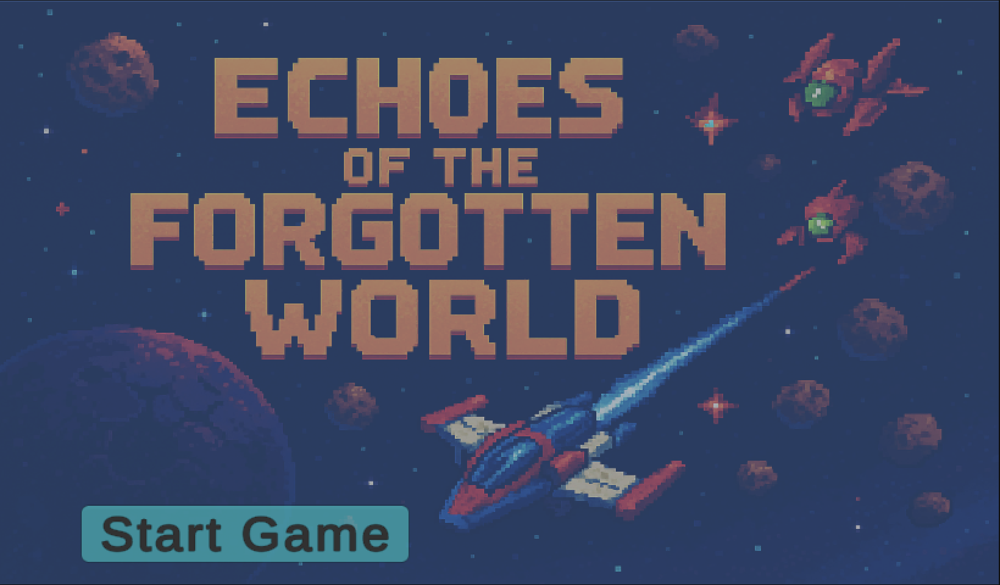
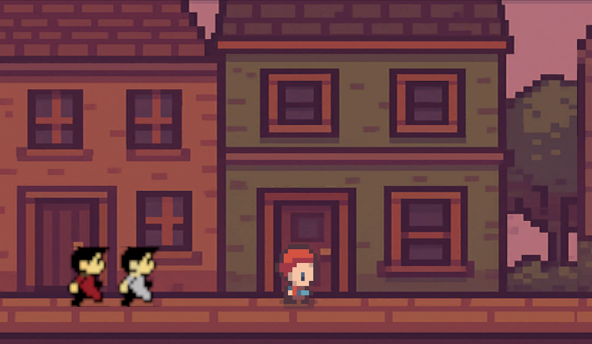
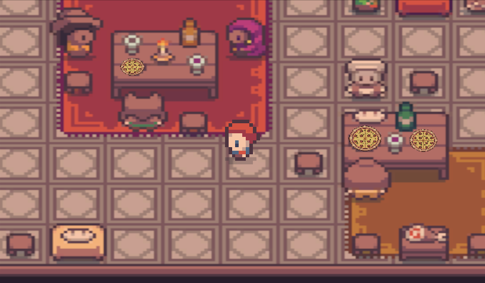
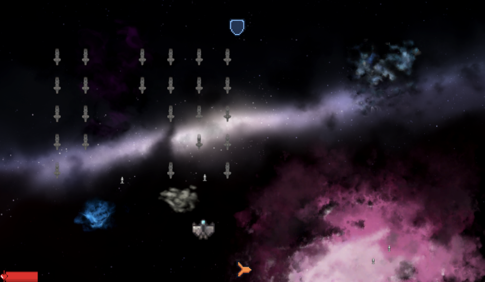
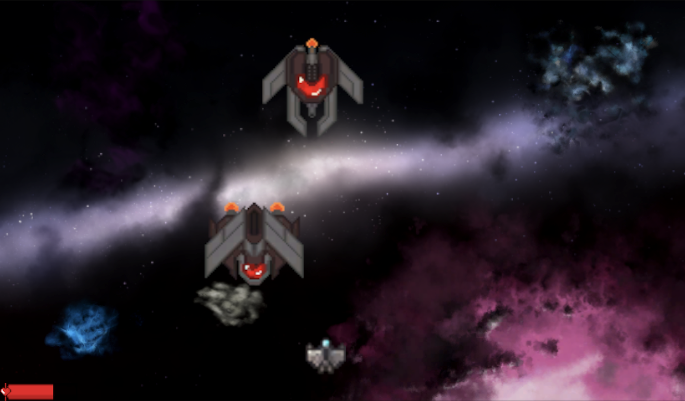
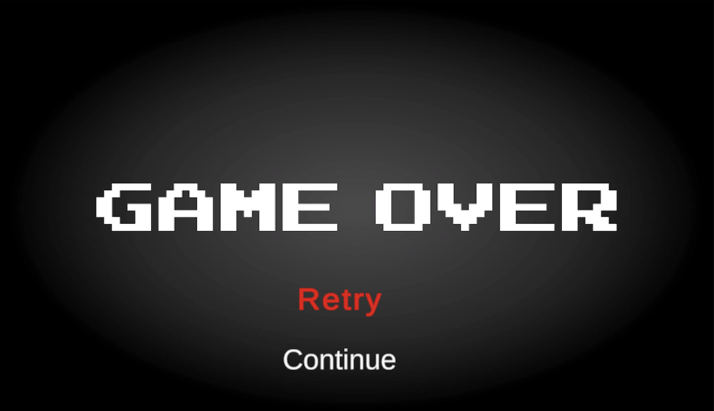
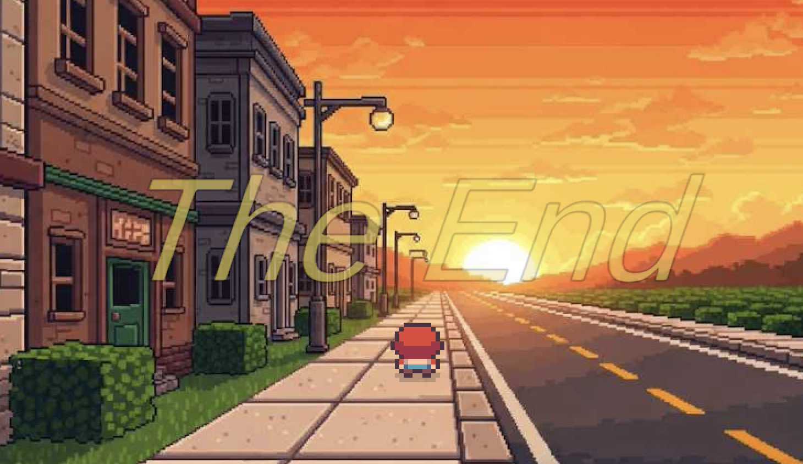

# Echoes of the Forgotten World

A 2D retro-styled adventure game that blends storytelling with classic arcade gameplay mechanics.

## Overview

**Echoes of the Forgotten World** follows Will, a red-haired school boy who discovers courage through an extraordinary adventure. While fleeing from bullies, Will stumbles upon a mysterious arcade machine that teleports him to a spaceship caught in an intergalactic battle. Through his bravery and quick thinking, Will helps deescalate the conflict and save the crew. His heroic actions grant him safe passage home, where he finds the strength to face his bullies and walk confidently into his future.

## Story & Gameplay

The game combines narrative-driven gameplay with classic arcade mechanics across multiple levels:

- **Story Levels**: Dialogue-rich cutscenes with 2D top-down exploration (similar to classic Zelda games) and side-scrolling platformer sections
- **Space Battle Levels**: Two action-packed levels featuring Space Invaders-style combat where players pilot spacecraft in intense battles
- **Character Development**: Watch Will's journey from a frightened boy to a confident hero through interactive storytelling

## Tech Stack

- **Engine**: Unity Game Engine
- **Programming Language**: C#
- **Game Style**: 2D Retro/Pixel Art
- **Gameplay Mechanics**: Top-down exploration, side-scrolling platformer, space shooter

## Project Stucture
```
Assets/
├── Animations/ (Animation clips and controllers)
├── Audio/ (Sound effects and music)
├── Fonts/ (Custom fonts for UI)
├── Materials/ (Material assets for 2D objects)
├── Prefabs/ (Reusable game objects)
│ ├── Characters/ (Player and NPC prefabs)
│ ├── Environment/ (Level elements and obstacles)
│ ├── UI/ (UI element prefabs)
│ └── Effects/ (Visual effects prefabs)
├── Scenes/ (Unity scene files)
├── Scripts/ (All C# code files)
│ ├── Player/ (Player control scripts)
│ ├── Enemies/ (Enemy behavior scripts)
│ ├── UI/ (User interface scripts)
│ └── Utilities/ (Helper functions and tools)
├── Sprites/ (2D graphics)
│ ├── Characters/ (Player and enemy sprites)
│ ├── Environment/ (Background and terrain sprites)
│ ├── Items/ (Collectible and usable item sprites)
│ └── UI/ (Icons and UI element sprites)
└── Tilemaps/ (Tilemap/background assets for 2D levels)
```

## Key Features

- **Multi-perspective Gameplay**: 
  - Top-down exploration with collision detection and interactive objects
  - Side-scrolling platformer sections with physics-based movement
  - Space Invaders-style combat with advanced shooting mechanics
- **Advanced Dialogue System**: 
  - Character avatar switching during conversations
  - Story-driven cutscenes with multiple speakers
  - Interactive dialogue progression
- **Comprehensive Power-up System**: 
  - 12+ unique power-ups including healing, shields, speed boosts, weapon upgrades
  - Temporary effects with duration-based mechanics
  - Rare and common power-up distribution system
- **Dynamic Boss Battles**: 
  - Multi-phase boss encounters with different attack patterns
  - Mini-boss and final boss progression system
  - Health-based damage visualization and animations
- **Sophisticated Scene Management**: 
  - Smooth transitions between levels with fade effects
  - Teleportation mechanics through the mysterious arcade machine
  - Scene tracking and state management
- **Audio-Visual Polish**: 
  - Particle effects for explosions, teleportation, and power-ups
  - Screen flash effects and visual feedback
  - Integrated sound system for atmosphere and feedback

## Installation & Setup

### Prerequisites
- Unity Hub (latest version)
- Unity Editor 6000.0.45f1
- Git (for cloning the repository)

### Installation Steps
1. **Install Unity Hub**
   - Download from [Unity's official website](https://unity.com/download)
   - Install Unity Editor 6000.0.45f1 through Unity Hub

2. **Clone the Repository**
   ```bash
   git clone https://github.com/Ashtin02/Echoes_Of_The_Forgotten_World.git
   cd Echoes_Of_The_Forgotten_World
   ```

3. **Open the Project**
   - Launch Unity Hub
   - Click "Add project from disk"
   - Select the cloned project folder
   - Open the project in Unity Editor

4. **Run the Game**
   - Press the Play button in Unity Editor to start the game
   - Use the Game view to play and test

## How to Play

### Basic Controls
- **Movement**: Use arrow keys or WASD to move Will
- **Interaction**: Press spacebar to interact with objects, advance dialogue, and confirm selections
- **Pause**: Press ESC to access the pause menu

### Gameplay Modes

**Story/Exploration Levels:**
- Navigate through environments using arrow keys or WASD
- Approach NPCs and objects, then press spacebar to interact
- Progress through dialogue by pressing spacebar

**Space Combat Levels:**
- Move your spaceship using arrow keys or WASD
- Press spacebar to fire projectiles at enemies
- Collect power-ups that fall from defeated enemies or spawn randomly
- Survive waves of enemies and defeat boss encounters

### Power-ups (Space Combat)
The game features an extensive power-up system including:
- **Healing & Defense**: Health restoration, shields, extra lives
- **Weapon Upgrades**: Double shot, triple shot, piercing bullets
- **Ship Modifications**: Speed boost, size changes (grow/shrink), ghost mode
- **Special Abilities**: Time slow, screen-clearing nuke, and more

## Screenshots

### Main Menu


### Story Mode - Side Scrolling Action


### Top-Down Exploration


### Space Battle Combat


### Boss Fight


### Game Over Screen


### Ending Scene


## Development Notes

This project was developed as a capstone project, showcasing advanced skills in:

### Game Programming & Architecture
- **Object-Oriented Design**: Modular script architecture with clear separation of concerns
- **State Management**: Complex scene transitions, game state tracking, and persistent data
- **Event-Driven Programming**: Boss defeat callbacks, collision handling, and UI interactions

### Unity Development Expertise
- **2D Physics Implementation**: Rigidbody2D movement, collision detection, and trigger systems
- **Animation Integration**: Animator controllers with trigger-based state changes
- **UI/UX Design**: Dynamic dialogue systems, health bars, and interactive menus
- **Audio Integration**: Sound effect management and audio source handling

### Game Design Principles
- **Player Experience**: Balanced difficulty progression and intuitive control schemes
- **Narrative Design**: Character-driven storytelling with meaningful player agency
- **Systems Design**: Interconnected power-up, health, and combat systems
- **Level Design**: Varied gameplay mechanics across different level types

### Technical Implementation Highlights
- **Coroutine-based Systems**: Smooth animations, timed events, and asynchronous operations
- **Polymorphic Design**: Flexible enemy types and projectile behaviors
- **Collision Optimization**: Efficient hit detection using Unity's 2D physics system
- **Memory Management**: Proper object destruction and resource cleanup

## Future Enhancements

Potential areas for expansion:
- Additional story chapters
- More combat mechanics and enemy types
- Enhanced graphics and animations
- Sound design and music integration
- Save system implementation

## Development Team

**Echoes of the Forgotten World** was developed by:
- **Mark Buster** ([MarkBuster](https://github.com/MarkBuster)) - [LinkedIn](https://linkedin.com/in/mabuster123)
- **Ashtin Rivada** ([Ashtin02](https://github.com/Ashtin02)) - [LinkedIn](https://linkedin.com/in/ashtin-rivada-5b85a2270)
- **Angela Fujihara** ([A-Fujihara](https://github.com/A-Fujihara))

## License

This project is licensed under the MIT License - see the LICENSE file for details.

## Contact

For questions or collaboration opportunities, feel free to reach out to any of the development team members through their GitHub profiles or LinkedIn.

---

*Echoes of the Forgotten World - A journey of courage, friendship, and self-discovery*

--------------------------------------------------------------------------------------------------------------------------------------------------------------------------------------------------------------------------------------


## **Angela's Blog**
**June 14 2025**

**"Echoes of the Forgotten World"**:

**Project Overview**
"Echoes of the Forgotten World" is our Unity-based game featuring enemy wave combat and teleportation mechanics through an arcade machine interface. This project gave us the opportunity to work with layered gameplay mechanics and polish our user interface and C# skills.

**Work Completed**
Over four weeks, I implemented several systems:

* **Enemy Wave System** - I designed and created the enemy ship assets for our three-wave combat sequence. Ashtin and I worked together extensively on debugging the spawn mechanics to get the wave progression working properly, as well as implementing the process of layering scenes. This process is similar conceptually to PhotoShop, the advantage of this is it allows (2) or more people to effectively work on the same scene but in different files and avoid merge conflicts. Once each scene is complete, they are simply layered on top of eachother, giving the effect of a single cohesive file.

* **Enhanced Teleportation Mechanism** - This became my favorite problem to solve. The original teleportation happened in a single frame—completely jarring. I rebuilt it using coroutines to spread the effect across multiple frames, creating that smooth transition we were after. I also added the white screen overlay for the arcade machine power-on effect. Coroutines are not dissimilar to async/await functions in JavaScript.
  
* **Audio Integration** - Implemented music systems throughout to enhance immersion and provide proper audio feedback for different game states.

* **UI Development** - Created both Game Over and Main Menu screens. The Main Menu's "Start Game" button provides seamless entry, while the Game Over screen includes restart functionality (with continue functionality implemented by Ashtin) to keep players engaged.

* **Level Polish** - Enhanced Level 1's aesthetic quality with sound effects and additional sprite assets.

**Technical Hurdles & Growth (Challenges & Solutions)**
The biggest challenge plagued us for half the development cycle: file synchronization nightmares during GitHub merges. We consistently found missing files after fetching and merging changes locally.

**The Line Ending Mystery** After diving into research, we discovered the culprit: line ending conversion between "LF" and "CRLF" formats. Mark and Ashtin were developing on Mac while I used Windows. These different line ending formats made GitHub perceive conflicts that didn't actually exist, completely overwhelming our merge process.

**Solution Implementation** We resolved this by implementing project-level configuration to maintain consistent "LF" line endings across all platforms.

**Process Adaptation**
This project reinforced how development workflows must adapt to specific technology challenges:

1. Unity's complex file structures and binary assets create unique merge conflict scenarios
2. Cross-platform development requires careful attention to seemingly minor details like line endings
3. Clear communication becomes even more critical when troubleshooting issues spanning multiple development platforms

**Key Learnings**
This project reinforced how every technology stack has its own quirks, and Unity definitely has a high propensity for merge conflicts due to its architecture. Working through these challenges as a team gave us all fresh perspective on how important clear communication becomes when troubleshooting technical issues across different development platforms. Most importantly, I think we gained renewed appreciation for how project requirements should drive process decisions. 


## Poster


--------------------------------------------------------------------------------------------------------------------------------------------------------------------------------------------------------------------------------------


## Angela's Blog 
# Breaking Into Game Development: My Unity Journey

## Project Overview
Our team is developing a 2D game in Unity inspired by classic arcade games. This project gives us the opportunity to explore game development principles while delivering something engaging and nostalgic.

## Work Completed
I concentrated on Level 1 - Scene 3, where I was responsible for:
- Sourcing and implementing scene assets
- Creating the arcade machine centerpiece
- Developing the character "materialization" effect as players enter the arcade machine
    - This scene serves as a crucial transition point in our game, setting up the player's entry into the game world.
- I developed the enemy ship and it's firing capablities. This was complicated as I wanted the movment to be a bit more 'natural' instead of a harsh zig-zag pattern.

## Technical Hurdles & Growth (Challenges & Solutions)
Working with Unity presented unique challenges compared to my previous coding experiences:

**Physics System Complexity**  
Unity's physics engine required significant self-education. I dove into documentation, articles, and tutorial videos to master the system's nuances. This research-heavy approach paid off when implementing the materialization effect, which needed precise physics calculations to appear natural.

**GitHub Integration Lessons**  
Unity's relationship with GitHub differs substantially from typical Java or Python projects. We discovered prefabs often required special handling with commands like:

git checkout upstream/main -- Assets/LevelLoader.prefab

These path-specific checkouts became essential to our workflow.

**Merge Conflict Evolution**  
The dual-nature of Unity development—working in both the Unity editor and VSCode—created multi-dimensional merge conflicts. Changes to the same sprite or physics component in Unity would create conflicts beyond just code, requiring careful coordination.

## Process Adaptation
This project revealed how different development environments benefit from tailored approaches:

1. We established a prefab notification system for pull requests, alerting team members when prefabs required special attention
2. We developed a "layering" approach to scene development, working in separate scenes before integration—similar to layers in Photoshop
3. This compartmentalization minimized conflicts while maintaining creative freedom

## Key Learnings
Returning to C# has been refreshing after my earlier alternative language project. The practical application within Unity expanded my understanding of the language a great deal.

More importantly, I've gained appreciation for how project requirements should shape development processes, not the other way around. Our team's adaptability in creating custom workflows specifically for Unity collaboration demonstrates this principle.


[Echoes of the Forgotten World Video Presentation](https://youtu.be/C_ioHrTwdL4)

[Echoes of the Forgotten World PowerPoint](CapstonePresentation.pdf)
